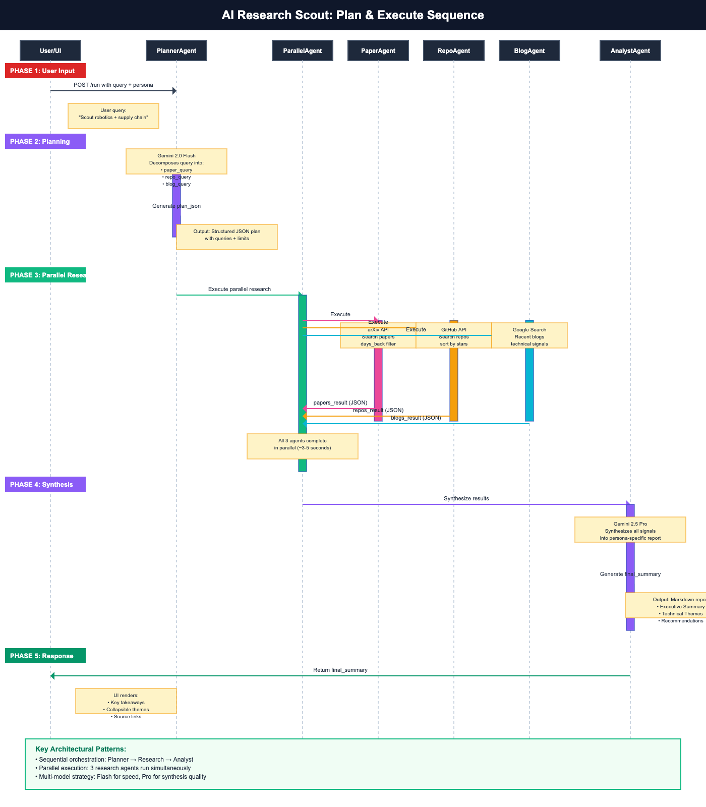

# System Architecture

AI Research Scout uses a hybrid sequential + parallel agentic architecture built on Google ADK.

## High-Level Flow (ASCII)
```
User (Persona: CTO / VC / Tech Leader)
              |
              v
+--------------------------+
|        Planner           |
|  (Gemini-powered)        |
+--------------------------+
              |
              v
+--------------------------+
|        Executor          |
|  (Orchestration Layer)   |
+--------------------------+
     |          |          |
     v          v          v
+---------+ +---------+ +---------+
| Paper   | | Repo    | | Blog    |
| Agent   | | Agent   | | Agent   |
+---------+ +---------+ +---------+
      \         |          /
       \        |         /
        v       v        v
+--------------------------------+
|     Gemini API Synthesis        |
+--------------------------------+
              |
              v
Decision-Oriented Recommendation
```

## Detailed Sequence Flow

The following diagram shows the complete request lifecycle through the agentic system:



### Phase 1: User Input
- User submits query via React UI with selected persona (VC/CTO/Tech Leader)
- Request routes to ADK backend via `/run` endpoint

### Phase 2: Planning (PlannerAgent)
- **Model**: Gemini 2.0 Flash
- **Input**: User query + persona context
- **Process**: Decomposes query into structured plan with:
  - Primary topic and subtopics
  - Targeted search queries for each channel (papers/repos/blogs)
  - Time windows (days_back) and result limits (max_papers, max_repos, max_blogs)
- **Output**: `plan_json` (structured JSON stored in session state)
- **Why Flash**: Fast response for structured output generation

### Phase 3: Parallel Research (ParallelResearchAgent)
Three agents execute simultaneously for efficiency:

#### PaperAgent
- **Tool**: arXiv API via custom `search_papers_func`
- **Process**: Searches academic papers with date filtering
- **Output**: `papers_result` (JSON with titles, authors, URLs, summaries)

#### RepoAgent
- **Tool**: GitHub API via custom `search_repos_func`
- **Process**: Searches repositories sorted by stars
- **Output**: `repos_result` (JSON with repo names, descriptions, activity metrics)

#### BlogAgent
- **Tool**: Google Search (ADK built-in)
- **Process**: Finds recent technical blogs and commentary
- **Output**: `blogs_result` (JSON with titles, snippets, source URLs)

**Parallelization Benefit**: Reduces total research time from ~15s (sequential) to ~5s (parallel)

### Phase 4: Synthesis (AnalystAgent)
- **Model**: Gemini 2.5 Pro
- **Input**: `plan_json` + `papers_result` + `repos_result` + `blogs_result`
- **Process**: Synthesizes multi-source signals into persona-optimized report
- **Output**: `final_summary` (Markdown formatted)
- **Structure**:
  - Executive Summary with key takeaways
  - Technical Themes (2-4 themes with supporting evidence)
  - Signals & Recommendations
- **Why Pro**: Superior synthesis quality, longer context window for multi-source analysis

### Phase 5: Response
- UI receives `final_summary` from session state
- React components render:
  - Key takeaways (bullet extraction)
  - Collapsible technical themes
  - Full report with proper formatting
  - Source links (papers, repos, blogs)

## Key Design Points

### Sequential + Parallel Hybrid
- **Sequential**: Planner → Research → Analyst (ensures proper data flow)
- **Parallel**: Paper/Repo/Blog agents run concurrently (maximizes throughput)

### Multi-Model Strategy
- **Gemini 2.0 Flash**: Planning and research (speed priority)
- **Gemini 2.5 Pro**: Final synthesis (quality priority)

### Persona-Aware Architecture
- Same data pipeline, different analytical lenses
- **VC**: Focus on market signals, investment timing, competitive dynamics
- **CTO**: Focus on implementation feasibility, technical risks, integration effort
- **Tech Leader**: Focus on team implications, platform fit, timeline recommendations

### JSON-First Design
- All inter-agent communication uses structured JSON
- Deterministic parsing with fallback sanitization (`executor.py`)
- Prevents prompt injection and ensures reliable state management

### Tool Integration
- **Native ADK**: Google Search
- **Custom Functions**: arXiv API, GitHub API
- **FunctionTool Wrapper**: Seamless integration with agent workflow

## ADK Layout

The `research_scout_agent/` directory lives at repo root per ADK conventions. This allows:
- Direct launch via `adk web` or `adk api_server research_scout_agent`
- Clean separation: agent definition vs. shared logic
- Follows Google's recommended project structure

Shared logic resides in `src/`:
- `planner.py`: Plan & Execute pipeline definition
- `executor.py`: Research agents + tools + AnalystAgent
- `memory.py`: Simple logging/persistence layer

## Scalability Considerations

### Current Design (Hackathon)
- Single-session state management
- In-memory orchestration
- Simple JSONL logging

### Production Enhancements
- **Distributed execution**: Celery/Ray for parallel agents
- **Persistent memory**: Vector DB for past research + RAG
- **Caching layer**: Redis for recent searches
- **Streaming responses**: Real-time UI updates per agent completion
- **Rate limiting**: Backoff strategies for external APIs
